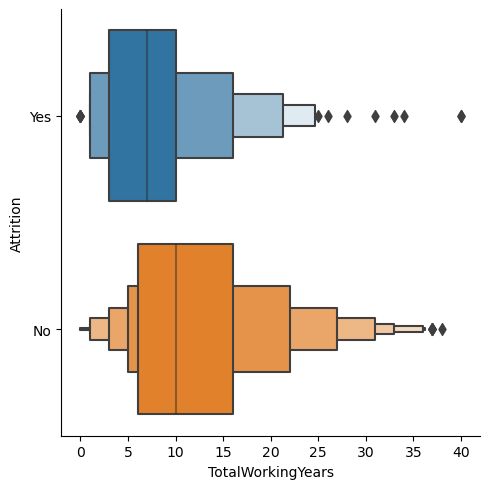

# Predicting Employee Attrition: Project Overview

Built a model for predicting whether or not an employee will leave (86% accuracy, 40% recall) with a interactive tool to help in designing retention interventions for employees that are high-risk and hard to replace
- Utilized a kaggle sample dataset for attrition analysis from ibm
- validated the data and explored features with respect to attrition
- reduced dimensions of compensation, experience, and sentiment features using PCA
- standardized features and compared CV accuracy and recall on four model types: k-nearest neighbors, logistic regression, random forest classifier, and stochastic gradient boosting classifier
- optimized the highest CV performer (logisistic regression) using gridsearch CV
- interpreted model coefficients to understand what features are likely to increase vs decrease attrition risk which employers also have some degree of control over in order to have some retention intervention strategies
- built a interactive visualization to assist in the identification of individuals for retention intervention and the type of intervention strategies that could help lower attrition risk for that individual

## Data Source

[kaggle ibm attrition dataset](https://www.kaggle.com/datasets/yasserh/ibm-attrition-dataset)

## Data Validation

- no missingness, but some features had zero variance and would have been useless to the model
- only 16% of observations represented employees that left, meaning a baseline model of guessing everyone stays would achieve 84% accuracy and 0% recall

## Exploratory Analysis

I analyzed how numeric features were distributed differently for leavers vs stayers and found leavers were on average:
- less experience
- lower paid
- longer commute
- lower sentiment on employee survey values
- traveled more for work
- worked more overtime

